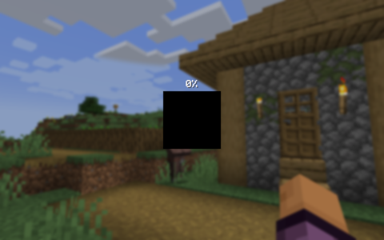

# Immersive Loading

This is a Minecraft mod for Fabric that replaces the background panorama with a
screenshot of the world you are entering. This gives a smooth transition into
the world and makes it feel more immersive. This screenshot will also be shown
while saving a local world. It works on both local worlds and servers.

## Screenshot

This is what it looks like when you are using the mod.

## Download

You can download the mod from any of these sites:

- [GitHub releases](https://github.com/magicus/immersive-loading/releases)
- [Modrinth versions](https://modrinth.com/mod/immersive-loading/versions)
- [CurseForge](https://www.curseforge.com/minecraft/mc-mods/immersive-loading/files)

## Installation

Install this as you would any other Fabric mod. (I recommend using [Prism
Launcher](https://prismlauncher.org/) as Minecraft launcher for modded
Minecraft.)

## Support

Do you have any problems with the mod? Please open an issue here on GitHub.

## Acknowledgements

This mod was inspired by [Seamless Loading
Screen](https://modrinth.com/mod/seamless-loading-screen), but that mod has not
been updated since Minecraft 1.21.1, and it always felt a bit overcomplicated
to me. So instead of trying to bring that up to date on modern Minecraft, I
decided to create a new mod that is simpler and more lightweight.

## Other Mods

Check out my other mods, which also supplies vanilla-style usability enhancements:

### Status Effect Timer

[Status Effect Timer](https://github.com/magicus/statuseffecttimer) is a
Minecraft mod for Fabric that overlays a timer on the Vanilla status effect HUD
icons.

### Mod Settings

[Mod Settings](https://github.com/magicus/ModSettings) is a Minecraft mod for
Fabric that provides an easy to access configuration screen for all installed
mods.

### Elytra Indicators

[Elytra Indicators](https://github.com/magicus/ElytraIndicators) is a Minecraft
mod for Fabric that provides Vanilla-style "fly by instrument" support for
elytra flight.
